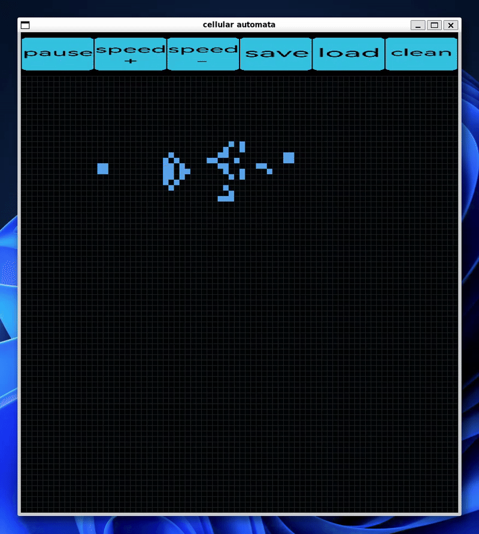
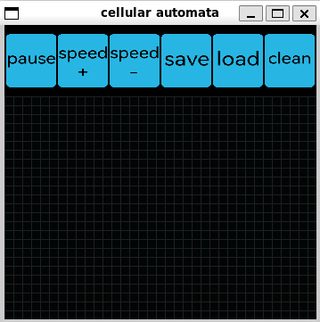

# cellular_automata
**Conway’s Game of Life** This is an end-of-semester project for Programming Basics course at the MEiL Faculty at WUT.



### Features
- Classic Conway's Game of Life
- Modifying the cells with mouse clicks
- Both keyboard and gui buttons control
- Saving and loading game state to file
- Configurable grid size
- Pure C
- Using only SDL2, SDL_image and standard C libraries

## Installation, compiling , execution and environment
### Environment
I'm using Ubuntu 24.04 LTS under WSL2 (WSLg required) running on Windows 11 25H2.
Compilation is done using GCC and a Makefile.
Visual Studio Code, connected to the WSL environment, is used as the editor, GIT gui and debugger.
### Installation
```
git clone https://github.com/AndrzejKalinowski/cellular_automata.git
sudo apt install gcc
sudo apt install make
sudo apt install gdb    ## debugger, omit if unused
sudo apt install libsdl2-dev
sudo apt install libsdl2-image-dev
```
### Compiling
Compilation is usually performed through Visual Studio Code using tasks and extensions, but can also be done manually:
```
make
```
### Running
Also could be done through the debugger:
```
make run
```
### Debugging
Debugging is done through VS code (as almost everything else). A Task is created to compile using the Makefile. Suitable launch configuration was also created for debugging. All of this is managed though VSC gui and json files. For starting the debugger just click on the launch configuration in the run tab.

## Usage
### Arguments
```
./gol.out [file] [width] [height]
```
- [file] - a path to a save file, if not provided a default file is used
- [width] [height] - (in cells) size of the game, the size read from the file takes priority, if not provided a default of 70x70 is used

### Example
```
./gol.out ./game_examples/glider_gun.gol
```
### Controls


Clicking on cells changes their state. Buttons and keyboard shortcuts:
- pause/space - pauses the game, allows to change speed, cell states etc.
- speed+/x - increases the game speed
- speed-/z - decreases  game speed
- save/s - saves the game state to the file provided in command line arguments
- load/r - load the game state from file
- clean/c - cleans the playing field

## General working principle
- The cell states are stored in a dynamically allocated 2D array
- Cell states are updated each frame
- Wrapping around is implemented
- Buttons are a custom implementation using structs
- The first line of a save file contains the game size

## Future improvements
- Zooming in
- Custom rule sets
- Undo/redo
- Coping/pasting groups of cells
- Performance improvements
- Better looking buttons

## Research and Resources 
Some of the resources that I've used for making this project.

<https://pl.wikipedia.org/wiki/Gra_w_%C5%BCycie>

<https://ccfd.github.io/courses/info1_lab08.html>

<https://www.youtube.com/watch?v=FWSR_7kZuYg>

<https://www.youtube.com/watch?v=mxWkj0KiICk>

<https://www.geeksforgeeks.org/c/pass-2d-array-parameter-c/>

<https://ccfd.github.io/courses/info1_lab06.html>